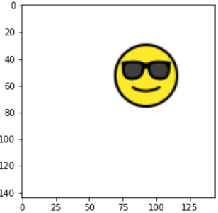

# ObjectLocalizationUsingTensorflow

This project is a simpler form of object detection in which we do both classification as well as localization of emoji in the given image but we deal with images with only one emoji(object).  

We use 9 images of emojis designed by [openmoji](https://openmoji.org/) as the nine classes of emojis as shown below:  

  

We generate a bigger size(144\*144) white image and embed the smaller sized one emoji(72\*72) out of 9 classes in a random position in the white image and keep track of emoji class and position. We prepare a new training data with this 144\*144 image as input image while emoji class(`class_out`) and position(`box_out`) as the two labels.  

    
  
  
Image with two labels(emoji class and bounding box) is as below:  

  

  
  

We design custom IoU(Intersection over Union) Metric for determining the accuracy of the bounding box drawn by our model.In the figure,
green box represents ground truth and red box represents prediction. This was the prediction made by the model after  epochs.

